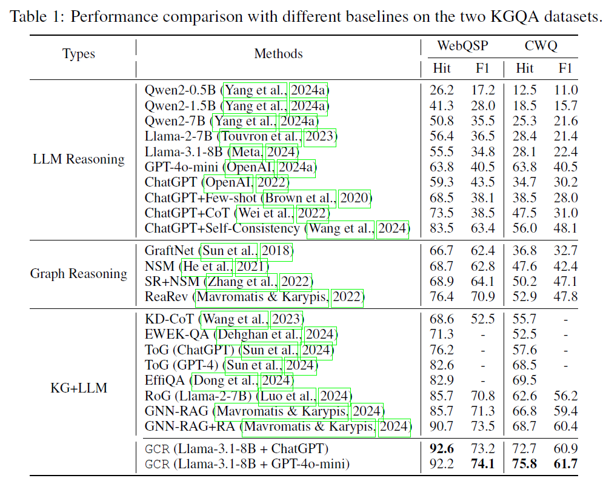

# Graph-constrained Reasoning (GCR)

Official Implementation of "[Graph-constrained Reasoning: Faithful Reasoning on Knowledge Graphs with Large Language Models](https://arxiv.org/abs/xx)".


Graph-constrained Reasoning (GCR) is a novel framework that  bridges structured knowledge in KGs with unstructured reasoning in LLMs. GCR ensures faithful KG-grounded reasoning by integrating KG structure into the LLM decoding process through KG-Trie. This allows LLMs to directly reason on graphs and generate faithful reasoning paths grounded in KGs to achieve accurate reasoning with zero reasoning hallucination. 

## Dependencies

We use [Poetry](https://python-poetry.org/) to manage dependencies.  CUDA 12.1 is recommended.

Step 1: Install `Poetry`   
`curl -sSL https://install.python-poetry.org | python3 -`

Step 2: Create a conda environment and install dependencies

```bash
conda create -n GCR python=3.12
conda activate GCR
poetry install
```

Step 3: Install Flash-attention for fast decoding

```bash
pip install flash-attn --no-build-isolation
```

## Build graph index

> [!NOTE]
> Our code will automatically download the data from Huggingface.

Build graph index for training: `scripts/build_graph_index.sh`

Graph index will be saved under: `data/graph_index`.

<details> <summary>[Optional] Build graph index for evaluation:</summary>

You can pre-build the graph index for faster evaluation. Otherwise, the evaluation script will build the graph index on-the-fly.   
```bash
DATA_PATH="RoG-webqsp RoG-cwq"
SPLIT=test
N_PROCESS=8
HOP=2 # 3
for DATA_PATH in ${DATA_PATH}; do
    python workflow/build_graph_index.py --d ${DATA_PATH} --split ${SPLIT} --n ${N_PROCESS} --K ${HOP}
done
```
</details>


## Training the lightweight KG-specialized LLM

We provide the training script for fine-tuning the lightweight KG-specialized LLM on the graph-constrained decoding task. 


In the script, we provide the following model configurations: `Qwen2-0.5B/1.5B/7B`, `Llama-2-7B`, and `Llama-3.1-8B`. But it can be easily extended to other LLMs.

Uncomment the corresponding "model configurations block" (Llama-3.1-8B by default) and run the script: `scripts/train_kg_specialized_llm.sh`.

Models will be saved at: `save_models/${SAVE_NAME}`.

The training resources and time for each model configuration are as follows:
 

> [!NOTE]
> We provide the pre-trained weights for the lightweight KG-specialized LLMs: `Qwen2-0.5B`, `Llama-2-7B`, and `Llama-3.1-8B`. You can find the pre-trained weights from [here](https://huggingface.co/collections/rmanluo/graph-constrained-reasoning-671052e5c808aa5e8c57501a) and use them for Inference.

## Inference

### Step 1: Graph-constrained decoding

We first adopt the KG-specialized LLM to generate several KG-grounded reasoning paths and hypotheses answers with beam-search.

> [!NOTE]
> Our code will automatically download the model weight from huggingface.

Run: `scripts/graph_constrained_decoding.sh`

```bash
MODEL_PATH=rmanluo/GCR-Meta-Llama-3.1-8B-Instruct
MODEL_NAME=$(basename "$MODEL_PATH")

python workflow/predict_paths_and_answers.py \
  --data_path rmanluo \
  --d {RoG-webqsp,RoG-cwq} \
  --split test \
  --index_path_length 2 \
  --model_name ${MODEL_NAME} \
  --model_path ${MODEL_PATH} \
  --k 10 \
  --prompt_mode zero-shot \
  --generation_mode group-beam \
  --attn_implementation flash_attention_2
```
Generated reasoning paths and hypotheses answers will be saved at: `results/GenPaths/{dataset}/{model_name}/{split}`.

### Step 2: Graph Inductive reasoning

We a general LLM to reason over multiple reasoning paths and hypotheses answers to produce the final answer without additional training.

Run: `scripts/graph_inductive_reasoning.sh`

```bash
python workflow/predict_final_answer.py \
  --data_path rmanluo \
  --d {RoG-webqsp,RoG-cwq} \
  --split test \
  --model_name {gpt-3.5-turbo, gpt-4o-mini} \
  --reasoning_path {REASONING_PATH} \
  --add_path True \
  -n 10
```

> [!NOTE]
> Note: you need to set your openai key at `.env` to use ChatGPT.

## Results



